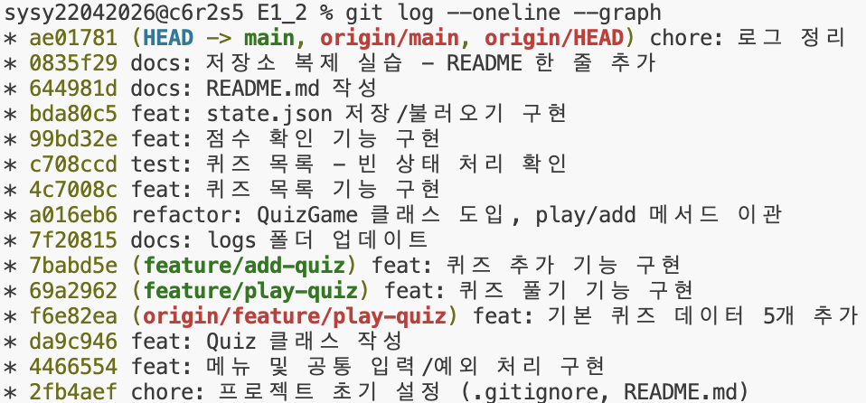

# 컴퓨터에게 명령 내리는 말(파이썬) 처음 배우기

## 프로젝트 개요
Python 표준 라이브러리만으로 구현한 터미널 기반 퀴즈 게임.
메뉴 선택(퀴즈 풀기/추가/목록/최고 점수 확인/종료)으로 동작하며,
state.json에 데이터를 저장해 프로그램 재실행 후에도 퀴즈·최고 점수 유지.

## 퀴즈 주제 선정 이유
세금 상식(원천징수, 연말정산, 과세표준, 부가가치세, 소득공제·세액공제 차이 등)
— 실생활에 필요한 기초 세금 지식 학습 목적.

## 실행 방법
python3 main.py

## 기능 목록
- 퀴즈 풀기: 문제 출제, 정답/오답 판정, 결과(정답 수·100점 환산) 표시
- 퀴즈 추가: 문제/선택지 4개/정답 번호 입력 후 등록
- 퀴즈 목록: 등록된 퀴즈 확인 (없을 시 안내)
- 최고 점수 확인: 최고 점수 조회·갱신 (미풀이 시 안내)
- 종료: 저장 후 안전 종료
- 공통 입력 검증: 공백 제거, 숫자 변환 실패, 범위 밖, 빈 입력 처리
- Ctrl+C / EOF 발생 시 저장 후 안전 종료
- state.json 없음/손상 시 기본 퀴즈로 복구

## 파일 구조
E1_2/
├── main.py
├── state.json
├── .gitignore
├── README.md
└── logs/
    ├── step_1_git_setup_log.txt
    ├── step_2_menu_input_log.txt
    ├── step_3_quiz_class_log.txt
    ├── step_4_default_quiz_data_log.txt
    ├── step_5_play_quiz_branch_log.txt
    ├── step_6_add_quiz_log.txt
    ├── step_7_quizgame_class_log.txt
    ├── step_8_quiz_list_log.txt
    ├── step_8_quiz_list_supplement_log.txt
    ├── step_9_score_log.txt
    ├── step_10_file_io_log.txt
    ├── step_11_readme_log.txt
    └── step_12_clone_pull_log.txt

## 데이터 파일 설명 (state.json)
- quizzes: 퀴즈 목록 (question, choices, answer)
- best_score: 최고 점수
- has_played: 풀이 여부
- UTF-8 인코딩 저장/불러오기
- 파일 없음 → 기본 퀴즈 사용 / JSON 손상 → 기본 퀴즈로 복구(안내 메시지 출력)
> clone/pull 실습 기록 - 2026-08-12

## 실행 결과 예시

**퀴즈 풀기** (logs/step_5_play_quiz_branch_log.txt)
```
정답 입력: 1
❌ 오답 (정답: 2번)
...
🏆 결과: 5문제 중 0문제 정답!
```

**퀴즈 추가** (logs/step_6_add_quiz_log.txt)
```
== 퀴즈 추가 완료 ==
```
- 빈 입력 → "⚠️ 문제 입력" / "⚠️ 선택지 입력"
- 정답 번호 빈 입력 → "⚠️ 입력값 없음 -> 다시 입력"
- 정답 번호 범위 밖(7) → "⚠️ 1-4 사이 숫자만 입력 가능 -> 다시 입력"
- 정답 번호 비숫자(ㅁ) → "⚠️ 숫자만 입력 가능 -> 다시 입력"

**QuizGame 클래스 도입 후 정상 동작** (logs/step_7_quizgame_class_log.txt)
```
🏆 결과: 5문제 중 2문제 정답!
🎉 새로운 최고 점수입니다! 🎉
```

**점수 확인** (logs/step_9_score_log.txt)
```
Enter your choice! (1-5): 4
⚠️  풀이 기록 없음
...
🏆 최고 점수: 20점
```

**state.json 저장/불러오기 및 손상 복구** (logs/step_10_file_io_log.txt)
```
📂 저장된 데이터 없음 -> 기본 퀴즈로 시작
📂 데이터 불러오기 완료 (퀴즈 6개, 최고점수 0점)
⚠️  데이터 손상 감지(Expecting property name enclosed in double quotes: line 1 column 2 (char 1)) -> 기본 퀴즈로 복구
```

## 브랜치 병합 기록

feature/play-quiz, feature/add-quiz 브랜치에서 기능 개발 후 main에 병합(fast-forward).

**feature/play-quiz → main** (logs/step_5_play_quiz_branch_log.txt)
```
$ git checkout main
$ git merge feature/play-quiz
업데이트 중 f6e82ea..69a2962
Fast-forward
 main.py | 31 +++++++++++++++++++++++++++---
 1 file changed, 28 insertions(+), 3 deletions(-)
```

**feature/add-quiz → main** (logs/step_6_add_quiz_log.txt)
```
$ git checkout main
$ git merge feature/add-quiz
업데이트 중 69a2962..7babd5e
Fast-forward
 main.py | 25 ++++++++++++++++++---
 1 file changed, 22 insertions(+), 3 deletions(-)
```

## 커밋 히스토리

`git log --oneline --graph` 실행 결과 (총 15개 커밋)

